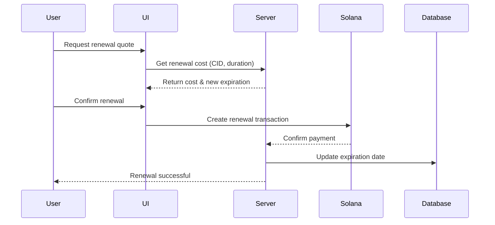

## Overview

With storage renewal you can extend the duration of your existing uploads before they expire, ensuring your files remain accessible on IPFS.

## Why Renewal Matters

When you upload files with toju, you specify a storage duration (e.g., 30 days). After this period:

- Files expire and are marked for deletion
- You receive an email (only if you provide it) warning 7 days before expiration
- Expired files are automatically removed from Storacha
- **Data is permanently lost** unless renewed

Renewal prevents data loss by extending the expiration date.

## How Renewal Works

<Steps>
  <Step title="Select File to Renew">
    From your upload history, choose a file that you want to extend
  </Step>
  
  <Step title="Check Current Expiration">
    View the current expiration date and days remaining
  </Step>
  
  <Step title="Choose Extension Duration">
    Select how many additional days to add (7, 30, 90, or custom)
  </Step>
  
  <Step title="Get New Cost Estimation">
    See the renewal cost based on file size and extension duration
  </Step>
  
  <Step title="Pay for Renewal">
    Sign a transaction with your Solana wallet to pay for the extension
  </Step>
  
  <Step title="New Expiration Set">
    The file's expiration date is updated immediately
  </Step>
</Steps>

## Cost Calculation

Renewal costs are calculated similarly to initial uploads:

```
Renewal Cost (SOL) = (File Size in MB × Additional Days × Base Rate) + Transaction Fee
```

The cost is **proportional** to:
- How large the file is
- How many days you're adding

<Info>
  You can get a cost quote before committing using the `getStorageRenewalCost` SDK method.
</Info>

## When to Renew

You should consider renewing when:

<CardGroup cols={2}>
  <Card title="Email Warning" icon="envelope">
    You receive an expiration warning (7 days before)
  </Card>
  <Card title="Active Monitoring" icon="chart-line">
    You check your upload history and see files approaching expiration
  </Card>
  <Card title="Long-Term Storage" icon="calendar">
    You know you'll need the files for an extended period
  </Card>
  <Card title="Critical Data" icon="shield">
    The files are important and shouldn't be lost
  </Card>
</CardGroup>

## Renewal vs Re-Upload

You might wonder: why not just re-upload the file?

**Renewal Advantages:**
- **Keeps the same CID**: Links to your file remain valid
- **No re-upload needed**: Saves bandwidth and time
- **Preserves history**: Maintains the original upload transaction record
- **Faster**: Just a payment transaction, no file transfer

**Re-Upload Disadvantages:**
- **New CID**: Old links break
- **Bandwidth cost**: No need to upload the file again
- **History fragmentation**: Looks like a new file, not an extension

<Check>
  Renewal is almost always the better choice for extending storage of existing files.
</Check>

## Payment Flow



## Email Notifications

toju sends automatic email reminders to help you avoid data loss:

<Steps>
  <Step title="7 Days Before">
    First warning email with expiration date
  </Step>
  
  <Step title="Expiration Day">
    Final notification that files will be deleted soon
  </Step>
</Steps>

<Warning>
  Email notifications only work if you provided an email address during the initial upload.
</Warning>

## Multiple Renewals

You can renew a file multiple times:

```
Initial Upload: 30 days → Expires Feb 1
First Renewal: +30 days → Expires Mar 3
Second Renewal: +90 days → Expires Jun 1
```

Each renewal:
- Adds to the current expiration date
- Creates a new transaction record
- Costs based on the extension duration

## Renewal Audit Trail

All renewals are tracked:

<Tabs>
  <Tab title="Blockchain">
    - Permanent record on Solana
    - Transaction signature
    - Payment amount
    - Timestamp
  </Tab>
  
  <Tab title="Database">
    - Linked to original upload
    - Previous expiration date
    - New expiration date
    - Extension duration
  </Tab>
</Tabs>

This creates a complete history of your file's storage lifecycle.

## Limitations

<Warning>
  **Cannot renew deleted files**: Once a file has been deleted after expiration, it cannot be renewed. You would need to re-upload it.
</Warning>

Other limitations:
- Minimum extension: 7 days (we're looking into making this flexible. So, do not fret.)
- Must have sufficient SOL in wallet
- Can only renew your own uploads
- Cannot renew before initial upload completes

## Best Practices

<AccordionGroup>
  <Accordion title="Enable Email Notifications">
    Always provide an email when uploading important files so you get expiration warnings.
  </Accordion>
  
  <Accordion title="Renew Early">
    Don't wait until the last day. Renew at least 3-5 days before expiration to avoid last-minute issues.
  </Accordion>
  
  <Accordion title="Batch Renewals">
    If you have multiple files expiring soon, renew them in one session to save time.
  </Accordion>
  
  <Accordion title="Consider Longer Durations">
    If you know you'll need the file long-term, renew for 90+ days to reduce transaction frequency.
  </Accordion>
</AccordionGroup>

## SDK Example

Quick example of renewing storage programmatically:

```typescript
import { useDeposit } from 'storacha-sol';

const client = useDeposit('testnet');

// Get renewal cost quote
const quote = await client.getStorageRenewalCost(cid, 30); // 30 additional days

console.log(`Current expiration: ${quote.currentExpirationDate}`);
console.log(`New expiration: ${quote.newExpirationDate}`);
console.log(`Cost: ${quote.costInSOL} SOL`);

// Proceed with renewal
const result = await client.renewStorageDuration({
  cid,
  additionalDays: 30,
  payer: publicKey,
  signTransaction
});

if (result.success) {
  console.log('Renewal successful!');
}
```

<Card title="SDK Reference" icon="code" href="/sdk/renewal">
  View complete renewal API documentation
</Card>
