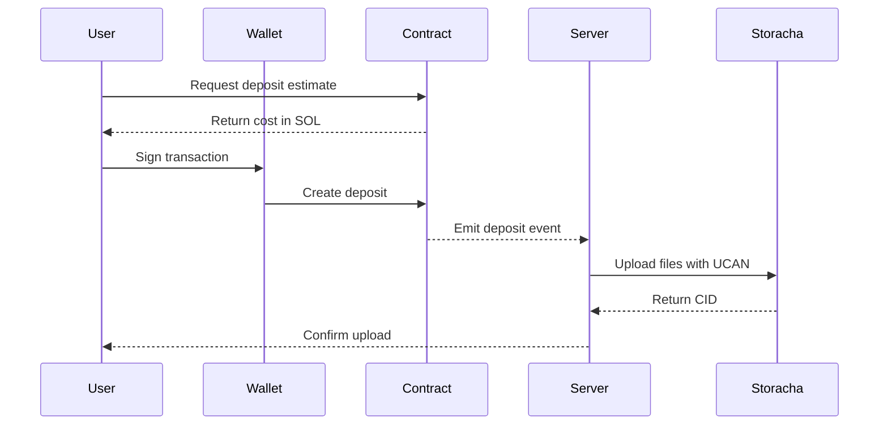

## Overview

We implement a pay-as-you-go model for decentralized storage using blockchain payments. Unlike traditional cloud storage with monthly subscriptions, users pay only for what they store and for how long. We currently support **SOL** (Solana) and **USDFC** (Filecoin).

## How It Works

<Steps>
  <Step title="Select Files">
    Choose one or more files to upload to decentralized storage
  </Step>
  
  <Step title="Choose Duration">
    Specify how long you want to store the files (minimum 7 days)
  </Step>
  
  <Step title="Get Cost Estimate">
    The system calculates the cost based on:
    - Total file size
    - Storage duration
    - Current network rates
  </Step>
  
  <Step title="Sign Transaction">
    Approve the payment with your wallet (Phantom for SOL, MetaMask for USDFC)
  </Step>
  
  <Step title="Onchain Deposit">
    For SOL: a deposit is created on the Solana blockchain via our smart contract. For USDFC: a token transfer is sent on Filecoin.
  </Step>
  
  <Step title="Storage Delegation">
    The server uses UCAN delegation to store your files on Storacha
  </Step>
</Steps>

## Cost Calculation

Storage costs are calculated using this formula:

```
Cost (SOL) = (File Size in MB × Duration in Days × Base Rate) + Transaction Fee
```

The base rate is dynamically calculated to cover Storacha storage costs while keeping prices competitive.

<Info>
  You can estimate costs before uploading using the `estimateStorageCost` SDK method.
</Info>

## Payment Flow



## Escrow Model

When you create a deposit:

1. **Funds are locked** in the smart contract
2. **Storage is provisioned** on Storacha immediately
3. **Funds are released** linearly over the storage duration to service providers
4. **No refunds** after upload (storage is already provisioned)

This escrow model ensures:
- Storage providers get paid
- Users get guaranteed storage duration
- No need for recurring payments

## Transaction Records

Every payment is recorded both:

<CardGroup cols={2}>
  <Card title="Onchain" icon="link">
    Permanent record on Solana blockchain with transaction signature
  </Card>
  <Card title="Database" icon="database">
    Indexed in our database for quick lookup and history tracking
  </Card>
</CardGroup>

## Supported Payment Chains

We currently support two payment methods:

- **SOL (Solana)**: Payments via our Solana smart contract with escrow and linear release
- **USDFC (Filecoin)**: Direct stablecoin transfers on Filecoin (1:1 with USD)

Coming soon:
- **Base (ETH)**: Ethereum L2 payments for lower gas fees
- **Additional chains**: Based on community demand

<Note>
  All payment methods store data on the same Storacha network. You choose whichever chain you prefer &mdash; the storage experience is identical.
</Note>

## Benefits

**For Users:**
- No credit card required
- Pay only for what you use
- Transparent, verifiable costs
- No recurring subscriptions

**For Developers:**
- Easy integration with crypto wallets
- No payment processing fees
- Instant settlement
- Global accessibility

## Limitations

<Warning>
  **No refunds**: Once files are uploaded, storage is provisioned and payments cannot be refunded. Make sure you've selected the correct duration before confirming.
</Warning>

- Minimum storage duration: 7 days
- Gas fees apply for each transaction
- Requires sufficient wallet balance
- Files expire after storage duration ends
